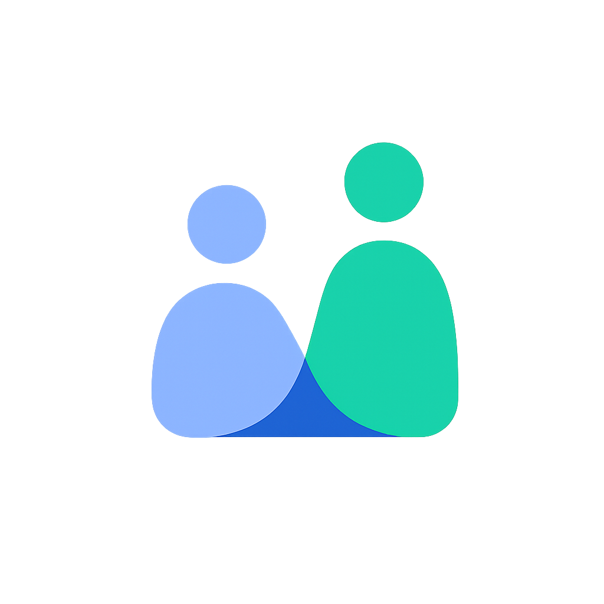

# ConnectSphere: Resource Sharing Platform

<div align="center">
  

  # ConnectSphere

  <p>
    A powerful MERN-stack application for sharing resources, where users can add their items, connect with each other, and view the location of products, similar to OLX.
  </p>

  <p>
    <a href="https://github.com/Mitraaxx/connectsphere/stargazers"></a>
    <a href="https://github.com/Mitraaxx/connectsphere/network/members"></a>
    <a href="https://github.com/Mitraaxx/connectsphere/issues"></a>
  </p>

  <p>
    <a href="https://cnntsphere.netlify.app"><strong>View Demo</strong></a>
    ·
    <a href="https://github.com/Mitraaxx/connectsphere/issues">Report Bug</a>
    ·
    <a href="https://github.com/Mitraaxx/connectsphere/issues">Request Feature</a>
  </p>
</div>

## Overview

**ConnectSphere** is a full-stack web application designed to provide a simple, secure, and efficient platform for resource sharing. Built with **MongoDB, Express.js, React, and Node.js (MERN)**, the application allows users to list items they want to share, browse items from other users, and connect with them. A key feature is the ability to see the location of products on a map, making it easy to find resources nearby.

The application features a modern, intuitive UI where users can register, log in, manage their listings, and contact other users. It's a complete proof-of-concept for a modern, web-based resource-sharing community.

-----

## Key Features

  - **Real-Time Authentication**: Secure user registration and login using JWT (JSON Web Tokens).
  - **Resource Listing and Management**: Users can create, update, and delete their resource listings with details and images.
  - **Location-Based Search**: View the location of products on an interactive map to find resources available in your vicinity.
  - **User Profiles**: Manage your profile and view the listings of other users.
  - **User Dashboard**: A centralized dashboard to view and manage your listed resources.
  - **Responsive Design**: A clean, mobile-first interface built with Tailwind CSS for a seamless experience on any device.
  - **Secure Communication**: Passwords are encrypted using `bcrypt.js`, and API routes are protected.

-----

## Tech Stack

### Frontend

  - **Framework**: React.js
  - **Routing**: React Router
  - **Styling**: Tailwind CSS
  - **State Management**: React Context API
  - **Mapping**: React Leaflet
  - **HTTP Client**: Axios

### Backend

  - **Runtime**: Node.js
  - **Framework**: Express.js
  - **Database**: MongoDB with Mongoose ODM
  - **Real-Time Engine**: Socket.IO (for future chat implementation)
  - **Authentication**: JSON Web Tokens (JWT) & `bcrypt.js`

-----

## Project Structure

```
.
├── backend
│   ├── controller
│   │   ├── auth.js         # Handles user registration and login logic
│   │   └── resource.js     # Handles logic for managing resources
│   ├── db
│   │   └── dbConnect.js    # MongoDB connection logic
│   ├── models
│   │   ├── userModel.js    # Mongoose schema for the User
│   │   └── resourceModel.js # Mongoose schema for Resources
│   ├── routes
│   │   ├── authRoute.js    # Defines authentication API endpoints
│   │   └── resourceRoute.js # Defines resource API endpoints
│   └── index.js            # Main server entry point
│
└── frontend
    ├── src
    │   ├── components      # Reusable UI components (e.g., Map, ResourceCard)
    │   ├── context
    │   │   └── userContext.jsx # Global state management for user session
    │   ├── pages
    │   │   ├── auth
    │   │   │   └── Auth.jsx      # Login and Signup page
    │   │   └── dashboard
    │   │       └── Dashboard.jsx # Main app dashboard for resource management
    │   ├── apiClient.js        # Centralized Axios instance for API calls
    │   └── App.jsx             # Main component with application routing
    └── index.css
```

-----

## Data Flow

1.  **Authentication**: A new user registers or an existing user logs in. The backend validates the credentials, hashes the password, and returns a JWT.
2.  **Session Management**: The JWT is stored in the client's local storage and is sent with every subsequent API request to authenticate the user.
3.  **Resource Management**: A logged-in user can create a new resource listing, providing details and a location. This data is saved to the MongoDB database.
4.  **Browsing Resources**: Users can view a list of all available resources. They can also view the location of each resource on a map.
5.  **User Interaction**: A user can view the details of a resource and contact the owner to arrange an exchange.

-----

## Development Setup

### Prerequisites

  - Node.js and npm (or yarn/pnpm)
  - MongoDB instance (local or cloud-based)

<!-- end list -->

1.  **Clone the repository:**

    ```sh
    git clone https://github.com/your-username/connectsphere.git
    cd connectsphere
    ```

2.  **Setup Backend:**

    ```sh
    cd backend
    npm install
    ```

    Create a `.env` file in the `backend` directory and add the following variables:

    ```env
    PORT=8000
    MONGOOSE_CONNECTION=<Your_MongoDB_Connection_String>
    JWT_SECRET=<Your_JWT_Secret>
    CLIENT_URL=http://localhost:3000
    ```

    Run the backend server:

    ```sh
    npm start
    ```

3.  **Setup Frontend:**

    ```sh
    cd ../frontend
    npm install
    ```

    The frontend is configured to proxy API requests to the backend server.
    Run the development server:

    ```sh
    npm run dev
    ```

<!-- end list -->

  - Frontend runs at: `http://localhost:3000`
      - Backend runs at: `http://localhost:8000`

-----

## Usage

1.  **Register/Login**: Open the application and create a new account or log in with existing credentials.
2.  **View Dashboard**: After logging in, you will be taken to the main dashboard where you can see and manage your listed resources.
3.  **Add a Resource**: Click the "Add Resource" button to create a new listing. Fill in the details and set the location for your item.
4.  **Browse Resources**: Navigate to the main resources page to see all available items. Use the map view to find items near you.
5.  **Contact a User**: Click on a resource to view its details and contact the owner.

-----

## Troubleshooting

  - **Failed to Fetch Resources**: Ensure the backend server is running and the `MONGOOSE_CONNECTION` string in your `.env` file is correct. Check for any CORS errors in the browser console.
  - **Map Not Loading**: Check if you have a stable internet connection. Ensure that the mapping library (e.g., React Leaflet) is correctly configured.
  - **Location Not Accurate**: Make sure you have granted the browser permission to access your location.
  - **Installation Errors**: If `npm install` fails, try deleting the `node_modules` directory and the `package-lock.json` file, then run `npm install` again.

-----

## Future Scope

  - [ ] **In-App Messaging**: Implement real-time text chat between users to facilitate communication.
  - [ ] **User Reviews and Ratings**: Allow users to rate and review each other after an exchange.
  - [ ] **Advanced Search and Filtering**: Add options to filter resources by category, distance, and other criteria.
  - [ ] **Push Notifications**: Implement browser push notifications for new messages and other important updates.
  - [ ] **Image Uploads**: Allow users to upload multiple images for their resource listings.

-----

## Contributing

We welcome contributions to enhance this project\! Please follow these steps:

1.  Fork the repository.
2.  Create a new branch: `git checkout -b feature/YourFeatureName`
3.  Make your changes and commit them: `git commit -m 'Add some amazing feature'`
4.  Push to the branch: `git push origin feature/YourFeatureName`
5.  Open a Pull Request.

-----

## Contact

For support or queries, please open an issue on the GitHub repository.